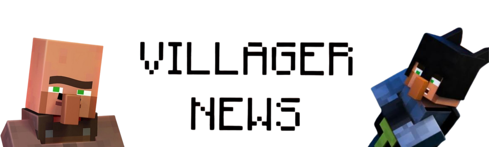

# 📰 Villager News (Add-on Port)



> *"Da-da-da-da-da-da-da-da... **VILLAGER NEWS!**"*

A faithful Java Edition port of Element Animation’s iconic **Villager News Bedrock Add-On**, engineered for modern Fabric!

Adds fully voiced villager reporters, interactive news anchors, superhero alter-egos, wearable cosmetics, and a complete 1:1 animated **Wooly the Sheep**.

---

## ✨ Features

### 🎙️ The Villager Newsroom & Anchors
- **Interactive News Reporters**: Villagers equipped with microphones and news desks delivering contextual dialogue, breaking news updates, and classic one-liners.
- **Dynamic Lip-Sync & Mouth Flaps**: Custom mouth shapes and facial animations that sync when villagers speak, trade, panic, or gossip.
- **Named Characters**: Name your villagers with nametags or spawn them directly:
  - **Villager #4** & **Villager #5** (Lead Anchors)
  - **Villager #9** (Field Reporter)
  - **Villager Unreachable** (*"Can't catch me!"*)
  - **Colin** and more!

### 🐑 Wooly the Sheep (1:1 Bedrock Animation Port)
- **Authentic Quadruped Locomotion**: True Bedrock diagonal trot, sprint gallop, and surface doggy-paddle swimming.
- **Continuous 4-Beat Turn-In-Place**: Real grounded stepping arcs without sliding, jitter, or unnatural foot-skittering.
- **Natural Secondary Motion**: Physical hurt flinch curves, non-snapping jump launch and apex transitions, grazing head dips with front hoof splay, and idle breathing.
- **Compatibility**: Fully compatible with normal Minecraft sheep, sheared states, dyed wools, and **Fresh Animations**.

### 🦸 Testificate Man
- The world's finest (and most questionable) superhero!
- Features his custom superhero suit, red cape, and flying helmet without texture clipping or z-fighting.

### 🎩 The Mayor
- Short, stout civic leader sporting his oversized top hat.
- **Scaled Hitbox**: Scaled to accurate baby villager hitboxes ($0.49 \times 0.98\text{ m}$), eliminating ghost air-hits above his head while retaining full adult trading and AI.

### 🎭 Wearable Items & Cosmetics
- **Villager News Handbook**: The official broadcast guide and item catalog.
- **Microphone**: Hold in main hand or off-hand to report the news live on scene.
- **Villager Nose & Moustache**: Disguise yourself or villagers with classic props.
- **Mayor’s Hat & Testificate Man’s Helmet**: High-society headwear and superhero headgear.

---

## 📋 Requirements

This mod relies on Traben’s feature suite for animations, textures, and voice lines:

| Dependency | Minimum Version | Recommended | Purpose |
| :--- | :--- | :--- | :--- |
| **Fabric Loader** | `>= 0.19.5` | Latest | Mod loader |
| **Fabric API** | Any | Latest | Core Fabric hooks |
| **EMF** (Entity Model Features) | `>= 3.3.5` | `3.3.8+` | Custom models & CEM animations |
| **ETF** (Entity Texture Features) | `>= 7.2.1` | `7.2.4+` | Custom skins, overlays & dyed wool |
| **ESF** (Entity Sound Features) | `>= 0.8.2` | `0.8.2+` | Voice lines & dialogue sound events |

---

## 🎮 Supported Versions

- **Minecraft**: `26.1`, `26.1.1`, `26.1.2`, and `26.2` (Fabric)
- **Fresh Animations**: Fully compatible alongside `Fresh Animations` and `FA Extensions`.

---

## 🔨 Building from Source

This project uses Gradle with Fabric Loom:

```bash
# Clone the repository
git clone https://github.com/NuzProjects/Villager-News.git
cd Villager-News

# Build the mod JAR
gradle build
```

The compiled mod JAR will be located in `build/libs/`.

---

## 📜 Credits & Acknowledgments
- **Element Animation**: Original creators of *Villager News* and the official Minecraft Bedrock Add-On.
- **Oreville Studios Ltd**: Creators of the official Bedrock Add-On.
- **NuzFlameV2**: Java Edition port and animation engineering.
- **FreshLX**: Creator of *Fresh Animations*.
- **Traben**: Author of EMF, ETF, and ESF.
